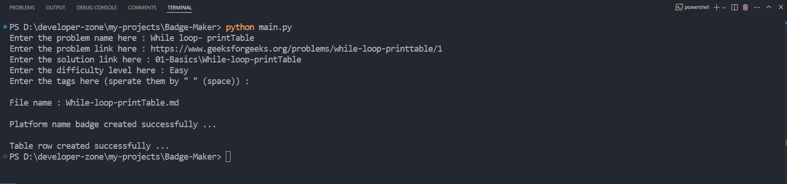
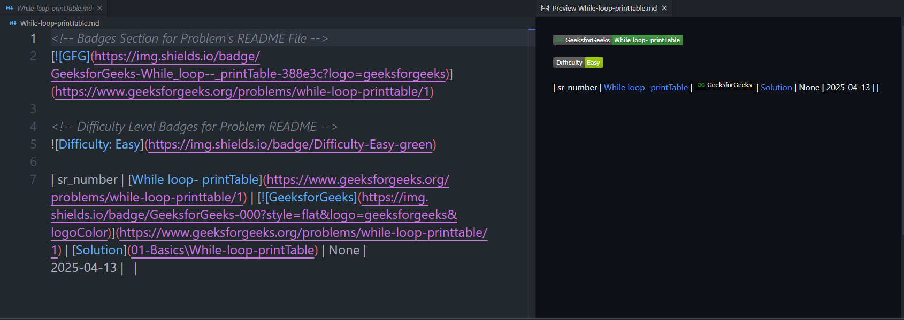

# Badge Maker for [problem-solving](https://github.com/Anshul-Padiyar/problem-solving) Repository

[](https://www.python.org/)
[](https://shields.io/)

A Python script that automates the creation of markdown badges and table entries for problem-solving's readme.md

### Features

- Generates platform-specific badges
- Creates difficulty level badges
- Supports multiple programming platform's URL:
  - GeeksForGeeks
  - LeetCode
  - HackerRank
  - CodeChef
- Creates formatted table rows for main README

### Platforms Badges

| Platform | Platform Badge | Problem Badge |
|---|---|---|
| LeetCode | [](#) | [](#) |
| GeeksForGeeks | [](#) | [](#) |
| HackerRank | [](#) | [](#) |
| CodeChef | [](#) | [](#) |

### Difficulty Level Badges

| Level | Simple Difficulty | Difficulty Badges |
|---|---|---|
| Basic |  |  |
| Easy |  |  |
| Medium |  |  |
| Hard |  |  |

## How to use?

1. Run the script:
   ```bash
   python main.py
   ```

2. Enter the required information:
   - Problem name
   - Problem URL
   - Solution URL
   - Difficulty level
   - Problem tags (space-separated)

3. The script will generate:
   - A markdown file with badges
   - A table row for your main problem list

## Example Output

### *ScreenShot : Terminal View*


### *ScreenShot : Generated File*

